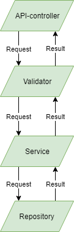
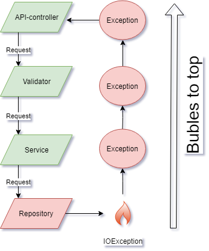
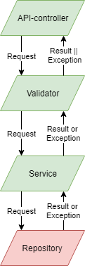

# Using the Try Monad for exception handling in GraphQL-java

In this blog post I will go through some practical examples of using the Try monad for exception handling in Java. The purpose is to see how we can write more functional code in a non-functional but widely adopted language such as Java. 

## What is a Try anyway?

The Try data structure is a special case of the Either data structure where one side is always an `Error` or an `Exception`. The point with using a Try instead of an Either is that it is very clear that it contains an `Error`, and may contain methods such as `mapFailure` and `mapResult`. 

In Java a typical methods returning a Try can look something like this in its signature 

```java
public Try<DatabaseObject, IOException> fetchDatabaseObject() {
   ...
}
```

This is read as an Try with either the `DatabaseObject` or the `IOException`. The result therefore contains either the `result` OR an `exception`, we can handle the exception as we would any other object in Java. It follow the same code path as every other result object.

The usual implementation which throws an exception would look like this. 

```java
public DatabaseObject fetchDatabaseObject() throws IOException {
   ...
}
```

Now they do not look much different. In one you have to treat the data structure returned with a result containing the `Exception` but in the other, since `IOException` is checked exception. you must also handle the IOException as a caller. We will see later that there are other advantages to using a Try instead of an Exception.

Often in Java we do not like checked exceptions because we do not know what to do with them and we instead wrap them in a `RuntimeException`. The rationale behind this is that since we do not know what to do with the `IOException` it is just as easy to throw an RuntimeException and let it bubble to the top. A typical pattern we can see is this in for example code which fetches some object from a database.

```java
public DatabaseObject fetchDatabaseObject() {
    Try {
        return databaseRepository.fetchObject();
    } catch (IOException e) {
        throw new RuntimeException(e);
    }
}
```

One problem with this approach is that we can not know if this method throws an exception or not by looking at the signature. We can jokingly say the we are lying in our method signatures. 

### Program flow with and without Try

To help understand the differences between using Try or normal exceptions, let's use an example. In this example we have an API-controller which get an HTTP-request and parses it. It then sends the parsed request down to a validator component which validates the request for the domain. Then the request is handled to a service layer which in turn uses a repository, the repository can for example be an external service or a database. The response from the repository is then returned up the layers and finally to the API-controller. This path is shown in the figure below



Now lets consider the error case where the repository code encounters an error situation and throws an Exception. The code flow would then look like this.



In this case which can be quite common in Java we throw an `Exception` and it will bubble to the top and be handled by our global exception handler which will log the error for developers to debug and return a nice response to the user. 

The last example will show the code flow when wrapping the result from the repository 



Here we get either the result or the exception. They follow the same path back to the API-controller and will likely be handled by the same API-controller and not by a global exception handler. One advantage of this approach is that errors follow the same code flow as normal application logic. 

### Try in Java

There is no native Try in java, so we have to get an implementation from a library or write it ourself. It can be a fun exercise to write our own Try-monad, but for now I will only reference some other popular libraries. [Vavr](https://www.vavr.io/vavr-docs/#_try) contains a Try monadic container and many other functional data structures and utilities, it is quite popular and widely adopted. Another great, but in my impression not so popular library is [cyclops](https://github.com/aol/cyclops). Their documentation is still a bit lacking but they do provide an excellent blog post series which goes into great depths on how to handle exceptions [dysfunctional programming in java: No Exceptions](https://medium.com/@johnmcclean/dysfunctional-programming-in-java-5-no-exceptions-5f37ac594323).

In the examples in this post I will use cyclops Try data structure, but is can easily be replaces by others.

## GraphQL and Java

[GraphQL](https://graphql.org/learn/) is a new way of building APIs that is quite different from traditional REST. This blog post will not go into depth about GraphQL, for that see the above mentioned link. Since GraphQL is transport agnostic, it does not use HTTP error codes to represent errors, errors are a part of the response and not something special that is handled in some other way. This blog post won't explain the details of GraphQL, but here is how the responses from a GraphQL API looks like.

```graphql
{
  "data": { ... },
  "errors": [ ... ]
}
```

In this response both `data` and `errors` are returned in the same response. This does look a lot like our `Try` data structure and this is one of the places where this data structure might be beneficial. 

GraphQL is also often used to fetch data from many different sources, these sources can be different databases, search engines or other APIs. If one of these sources is down we can still return a partial response with the data instead of failing the whole request. 

## GraphQL-java

[GraphQL-java](https://github.com/graphql-java/graphql-java) is a Java implementation of GraphQL. It implements the GraphQL specification in Java. It is typical to expose a GraphQL API over HTTP and there are many project which connects GraphQL-java to a servlet. The example code provided here will use the `graphql-spring-boot` package and `graphql-java-tools` to make it easy to expose a GraphQL-API over HTTP, provide an interactive `GraphiQL`-client and use the schema first approach from `graphql-java-tools`. 

GraphQL APIs is naturally a Graph and they can be written in their own graphql schema language. A schema consists of types and their relationships with each other. A simple example of a schema with a Person type can be this.

```graphql
type Person {
  id: String!
  name: String!
  programmingIn: [ProgrammingLanguage!]!
}

type ProgrammingLanguage {
  name: String!
  functional: Boolean!
}
```

Here we have a person type which has an id, a name and a list of programming languages the person is programming in. The `ProgrammingLanguage` type has a name and a boolean if it is a functional language or not. The exclamation mark means the fields are `non-nullable` i.e cannot return `null`. 

### graphql-java-tools

When using `graphql-java-tools` we write resolvers for our fields in the graphQL-schema. These resolvers are automatically called by `graphql-java-tools` when graphql should fetch data for a field. This avoids much boiler plate code with plain `graphql-java`. A resolver can return a `pojo` containing the fields we should resolve and may also contain other fields which will be ignored. It can also return a wrapped `pojo` in either `Future` or `CompleteableFuture`. The latter one can be used with `BatchLoaders` which can batch together many fields from different places in the Graphql query and does a batch fetching for those fields. 

An example of a GraphQL resolver for the Person field.

```java
class ObjectResolver implements GraphQLResolver<Person> {
    // Here we expect the user of the API to  provide a user id as a String.
    public Person getPerson(String userId) {
      return personService.fetchPerson(userId);
    }
}
```

## Using Try with GraphQL-java

Now how do we use a Try data structure with GraphQL-java and `Resolvers`? The trick is that a resolver implementation can in addition to returning `pojo`s representing the data, they can also return a `DataFetcherResult<T>` containing the datatype or errors for the field. If we already have returned a `Try<T, IOException>` from our repository we only need to make a generic method to fold the try from a `Try<T, IOException>` to the `DataFetcherResult<T>`. 

```java
public <T> DataFetcherResult<T> fromTry(Try<T, IOException> tried) {
    tried.fold(
        data -> DataFetcherResult.newResult.data(data).build(),
        exception -> DataFetcherResult.newResult.error(new MyGraphQlError(exception))
    )
}
```

By doing this we can easily wrap all of our exceptions all the way from the repository and up to the GraphQL-layer in our application. This allows us to write code that does not throw exceptions but instead wraps them in `Try` data structures and later in `DataFetcherResult` before returning them in the GraphQL-api. 

## What advantages are there to using Try instead of exceptions? 

We are forced by the compiler to handle the exceptions early and cannot write code that just ignores the possibility that there might be thrown exceptions. The control flow of the application is the same and since a GraphQL response might contain both data and errors, we can anticipate what the final response will be when errors are thrown. If we instead used `Exceptions` it can be hard to reason how the final GraphQL response to the user will look like. 

### Simply coding style when using simple resolvers.

Writing code that does not throw exceptions might be a goal in itself. It makes the signatures of methods honest and not lying if they are throwing a `RuntimeException` and you do not notice it. On the flip side the code is now littered with `Try` everywhere which might be problematic since it is often easier to just throw a `RuntimeException` and have it handled automatically by some root exception handler rendering an error in the GraphQL-field, after stripping away stack traces of course. I think these two styles boils down to personal preferences, and the end result in the API can be the same. 

### Complex resolvers using data loaders. 

When writing more complex resolvers which for example fetches from an external API, but we need to batch our calls to the external API because of resource constraints. When calling this external API we must accept that each batch may fail independently of each other. However in our application we would like to get a list with all the results even tough we need to batch them for the external API. When we are using exceptions for this what will happen if one of the batches fail? We would throw an exception and let it bubble to the top and our result to the end user would be an error page. If we however wrap each result in a Try, if one batched request fails, we still get a list with all the remaining results and exceptions for the rest. This plays nicely with GraphQls ability to get back partial results. 

An example of a GraphQl response can be.

```json
{
  "data": {
      "batchResults": {
       "1": "data1",
       "2": "data2",
       "4": "data4"
      }
  },
  "errors": {
    "message": {
      "code": 500,
      "errorMessage": "An error occurred when trying to call external service. Try again later."
    }
  }
}

```
Here we have gotten the results we were able to fetch and errors for those we could not fetch. The client is then able to make due with what it received and can judge for itself how to show the user the error and the results. 

When coding a resolver for this in Java it is much easier to wrap the exceptions as part of the normal response in order to support partial results and also have one code path for both the results and the exceptions. In this case the exceptions are not something special which occurs in our codebase, exceptions is something we expect to get back and handle. 

### But java can still throw errors

Yes, the JVM can still produce `OutOfMemoryExceptions` and the like. There might be hidden `RuntimeExceptions` from external libraries being thrown which we do not know where to catch in our code. I would argue that these exceptions are fine, since when they are severe enough like an `OutOfMemoryException` there is not much we can do in code other than to crash. If you have external dependencies which throws `RunTimeExceptions` you can either use the Try-monad as best you can and encapsulate them or just let them bubble to the top and be handled by your global exception handler. Since it is in Java you should have an global exception handler anyway.  

### In the end the answer is `it depends`

Should you embrace writing functional code in a non-functional language like java? Are the functional paradigm really that much better than traditional object oriented code? The answer is off course it depends. It depends on how familiar you are with functional languages and concepts, how is the rest of the code base structured? Are you staring a new project or is this a huge existing code base which have sophisticated error handling in place already and introducing something new can make the code base as a whole harder to read since it now has two different ways of dealing with exceptions. For me personally writing more functional java code has been quite fun and a big learning experience. For our GraphQL-API using the Try-monad for handling exceptions has been much easier for us to have control over the response returned to the user and the tests are easier to write since an exception is just like a normal response.
